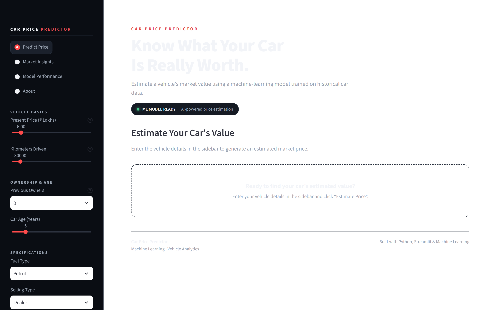
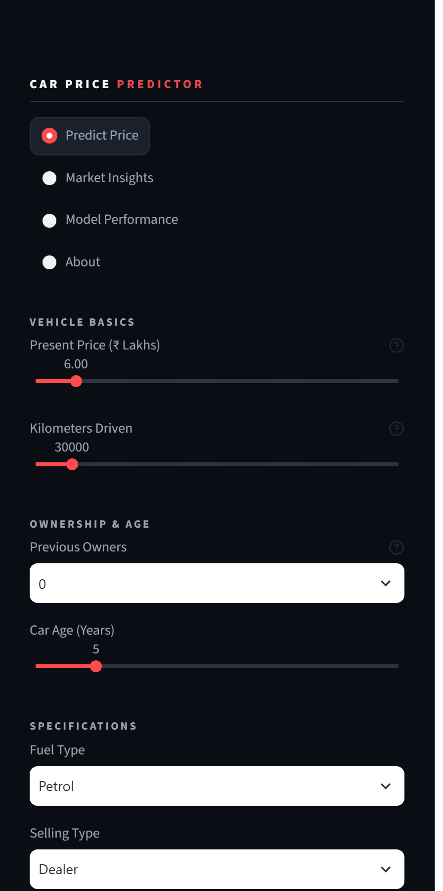
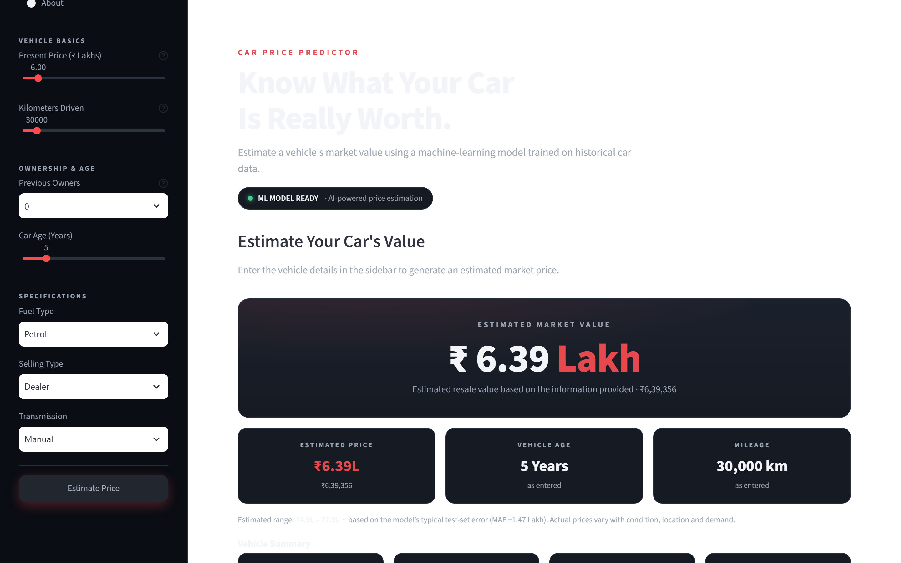
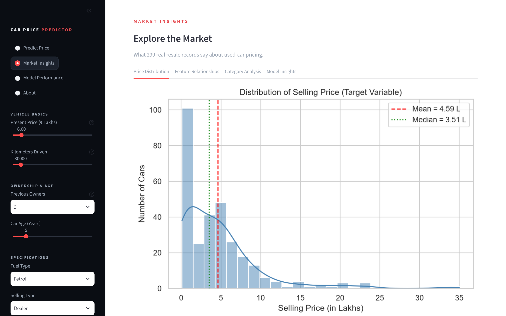
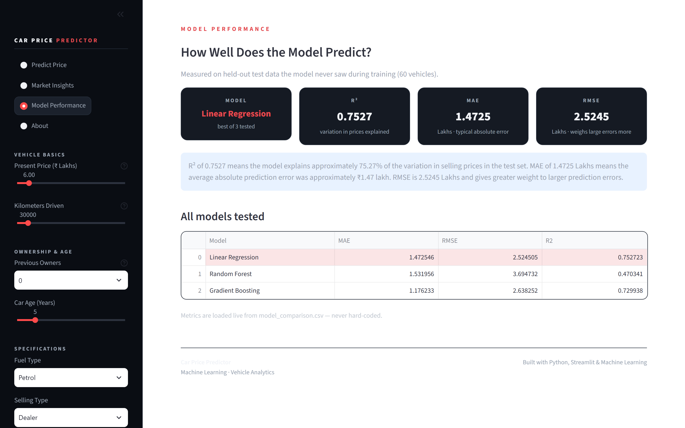

# 🚗 Car Price Prediction

An end-to-end machine learning application that estimates used-car prices from vehicle characteristics through an interactive Streamlit interface — from data cleaning and EDA to a deployed, independently validated web app.


---

## 📸 Application Preview

Screenshots captured from the running application.

### 🏠 Home

The landing page — hero section with the application's purpose and the "ML MODEL READY" status indicator.



### 🚗 Prediction

The vehicle detail inputs — showroom price, kilometers driven, previous owners, car age, fuel type, selling type and transmission.



### 💰 Result

A real model prediction (6.0 Lakh showroom price, 30,000 km, 5-year-old Petrol, Dealer, Manual) — estimated price, an uncertainty range based on the model's test-set error, and the vehicle summary.



### 📊 Market Insights

The exploratory analysis gallery — price distribution, feature relationships, category comparisons and model insights across four tabs.



### 🤖 Model Performance

Test-set metrics (R², MAE, RMSE) loaded dynamically from `model_comparison.csv`, with the full model comparison table.



---

## 📌 Project Overview

**What it does:** the application takes a vehicle's characteristics — current showroom price, kilometers driven, previous owners, age, fuel type, selling type and transmission — and returns an estimated selling price in Indian Lakhs, generated by a trained regression model.

**The problem it solves:** selling a used car raises the same question for dealers, marketplaces and individual sellers — *"What is a fair price for this vehicle?"* Pricing too high deters buyers; pricing too low loses money. This project learns pricing patterns from historical sales data and turns them into an objective starting point for pricing decisions.

**Who could use it:** used-car dealers, online marketplaces, and individual sellers who want a data-driven reference point when listing, comparing or negotiating a vehicle's price.

**Why machine learning:** the relationship between vehicle attributes and resale value is hard to capture with hand-written rules. A regression model learns the combined effect of price, age, usage and category from real sales records — and quantifies its own reliability through standard evaluation metrics.

> ⚠️ The model produces a statistical **estimate**, not a guaranteed market value. Actual vehicle prices vary with condition, location, demand, ownership history and other factors.

---

## ✨ Key Features

- 🧭 **Interactive multi-step prediction wizard** — Vehicle Basics → Usage & History → Specifications → Review & Estimate
- ⬅️ **One-step-at-a-time Back navigation** — entered values are preserved when moving back or forward
- 🚗 **Complete vehicle detail inputs** — showroom price, kilometers, owners, age, fuel, selling type, transmission
- 🤖 **Machine-learning price estimation** — the saved scikit-learn Pipeline does all preprocessing and prediction
- ₹ **Indian currency formatting** — `₹6.39 Lakh`, `₹6,39,356`, and a readable caption under the price control
- 💰 **Price UI extending to ₹3 Crore** — with an honest note when a value exceeds the training data's range
- 🧾 **Prediction result card** — estimated value, rupee amount, and an uncertainty range based on test-set MAE
- 📋 **Vehicle summary** — the entered details shown next to the result for verification
- 📊 **Market Insights** — 14 visualizations across four tabs (distribution, relationships, categories, model insights)
- 📈 **Model Performance section** — evaluation metrics loaded dynamically from `model_comparison.csv`, never hard-coded
- 🎨 **Warm neutral automotive theme** — clean, responsive, professional UI

---

## ⚙️ How It Works

1. **Enter details** — the user describes the vehicle through the guided wizard.
2. **Process** — the application assembles one raw pandas DataFrame with the exact feature names the model was trained on.
3. **Predict** — the saved Pipeline (imputation → one-hot encoding → Linear Regression) generates the estimated price.
4. **Display** — the result appears with Indian currency formatting, a range based on typical test-set error, and a vehicle summary.
5. **Explore** — the user can review market visualizations and live model performance metrics.

---

## 🤖 Machine Learning Approach

**Dataset:** `car data.csv` — 301 rows × 9 columns of used-vehicle sale records. After cleaning: 299 rows (2 exact duplicates removed, no missing values). After feature engineering: 299 rows × 10 columns.

| Feature | Type | Description |
|---|---|---|
| Present_Price | Numerical | Current/showroom price in Lakhs |
| Driven_kms | Numerical | Kilometers driven |
| Owner | Numerical | Number of previous owners |
| Car_Age | Numerical | Vehicle age in years (engineered as `2026 − Year`) |
| Fuel_Type | Categorical | Petrol / Diesel / CNG |
| Selling_type | Categorical | Dealer / Individual |
| Transmission | Categorical | Manual / Automatic |
| **Selling_Price** | **Target** | Selling price in Lakhs |

`Car_Name` (98 unique labels in 299 rows, including motorcycles) was excluded to avoid high-cardinality overfitting; `Year` was replaced by `Car_Age`; the target was never used as an input (no data leakage); no unavailable features (horsepower, brand goodwill) were fabricated.

**Preprocessing & encoding:** numeric features receive median imputation; categorical features receive most-frequent imputation plus one-hot encoding (`handle_unknown="ignore"`). All of it lives **inside** a scikit-learn `ColumnTransformer` + `Pipeline`, fitted on training data only.

**Train/test split:** 80/20 (`random_state=42`) → 239 training / 60 testing rows.

**Models compared** (each in its own Pipeline, identical split):

1. Linear Regression
2. Random Forest Regression (300 trees)
3. Gradient Boosting Regression

**Evaluation:** MAE, RMSE and R² on the held-out test set; the best model was selected by highest R² (RMSE as tie-break). Feature influence for the linear model was analyzed via absolute standardized coefficients.

**Saved model:** the complete fitted Pipeline is serialized to `car_price_model.pkl` with joblib — preprocessing and model together, so the app accepts raw feature values.

**Observed relationships in the training data** (associations, not causation): Present_Price correlates ≈ **+0.88** with Selling_Price, Car_Age ≈ **−0.23**, Driven_kms ≈ **+0.03**. Selling_Price is right-skewed (skewness 2.54).

---

## 📊 Model Performance

| Model | MAE (Lakhs) | RMSE (Lakhs) | R² |
|---|---|---|---|
| **Linear Regression** ⭐ | **1.4725** | **2.5245** | **0.7527** |
| Random Forest | 1.5320 | 3.6947 | 0.4703 |
| Gradient Boosting | 1.1762 | 2.6383 | 0.7299 |

*(Actual results from `model_comparison.csv`.)*

- **R² = 0.7527** — the model explains approximately 75.27% of the variation in selling prices in the test set.
- **MAE = 1.4725 Lakhs** — the average absolute prediction error was about ₹1.47 lakh on the test set.
- **RMSE = 2.5245 Lakhs** — like MAE but more sensitive to large errors, since errors are squared before averaging.

> These metrics come from the project's own evaluation data (a single 80/20 split, `random_state=42`). They describe how the model performed on that test set — **not a guarantee of real-world pricing accuracy**.

---

## ⚠️ Important Limitation

The UI allows price inputs up to **₹3 Crore** for flexibility, but the training data reaches only about **₹92.6 Lakh** (the most expensive vehicle observed).

- Predictions for vehicles **within** the training range are grounded in the model's learned patterns.
- Values **far beyond** that range are extrapolations and should be treated with caution.
- The ₹3 Crore UI range does **not** mean the model was trained on ₹3 Crore vehicles — the app shows a clear notice whenever an input exceeds the training distribution.

---

## 🛠️ Tech Stack

Confirmed from `requirements.txt` and the source code:

- **Python** — application and pipeline code
- **pandas** — data manipulation
- **NumPy** — numerical computation
- **scikit-learn** — modeling, pipelines, metrics
- **Joblib** — model serialization
- **Streamlit** — web application
- **Matplotlib / Seaborn** — visualization (used by the analysis scripts that generate `charts/`)

---

## 📁 Project Structure

```
Car-Price-Prediction/
│
├── car data.csv                      # Original dataset (never modified)
├── df_features.csv                   # Cleaned + engineered dataset
│
├── data_inspection.py                # Step 1: read-only data inspection
├── data_preprocessing.py             # Step 2: cleaning -> df_clean
├── data_feature_engineering.py       # Step 3: Car_Age -> df_features
├── data_analysis.py                  # Step 4: EDA + charts
├── model_training.py                 # Step 5: train/evaluate 3 models
├── model_analysis.py                 # Step 6: analysis + business insights
├── app.py                            # Step 7: Streamlit web application
├── app_test.py                       # Headless sanity check of the model
│
├── model_comparison.csv              # MAE / RMSE / R2 for all models
├── predictions.csv                   # Actual vs predicted (test set)
├── feature_importance.csv            # Standardized coefficient importance
├── category_price_analysis.csv       # Average price by category
│
├── car_price_model.pkl               # Saved Pipeline (preprocessing + model)
│
├── business_insights.txt             # Business insights report
├── model_report.txt                  # Final model report
├── requirements.txt                  # Python dependencies
├── README.md                         # This file
│
├── screenshots/                      # README preview images
│   ├── home.png
│   ├── prediction-form.png
│   ├── prediction-result.png
│   ├── market-insights.png
│   └── model-performance.png
│
└── charts/                           # 14 generated visualizations
    ├── 01_price_distribution.png
    ├── 02_present_vs_selling_price.png
    ├── 03_car_age_vs_selling_price.png
    ├── 04_km_vs_selling_price.png
    ├── 05_fuel_type_price.png
    ├── 06_transmission_price.png
    ├── 07_selling_type_price.png
    ├── 08_correlation_heatmap.png
    ├── 09_fuel_average_price.png
    ├── 10_transmission_average_price.png
    ├── 11_actual_vs_predicted.png
    ├── 12_feature_importance.png
    ├── 13_prediction_error_distribution.png
    └── 14_actual_vs_predicted_best_model.png
```

---

## 🚀 Installation

### Clone the repository

```bash
git clone https://github.com/VRUSHANKMVENKAT/Car-Price-Prediction.git
cd Car-Price-Prediction
```

### Create a virtual environment

Windows:

```bash
python -m venv .venv
.venv\Scripts\activate
```

Linux/macOS:

```bash
python3 -m venv .venv
source .venv/bin/activate
```

### Install dependencies

```bash
pip install -r requirements.txt
```

### Run the application

```bash
streamlit run app.py
```

Then open the displayed local URL (typically `http://localhost:8501`) in your browser.

<details>
<summary>Running the individual pipeline scripts (optional)</summary>

Each script is independent and prints its own report; the original `car data.csv` is never modified:

```bash
python data_inspection.py          # Step 1: dataset inspection
python data_preprocessing.py       # Step 2: cleaning summary
python data_feature_engineering.py # Step 3: Car_Age + df_features.csv
python data_analysis.py            # Step 4: regenerate EDA charts
python model_training.py           # Step 5: retrain + compare models
python model_analysis.py           # Step 6: regenerate analysis reports
python app_test.py                 # headless model sanity check
```
</details>

---

## 🖥️ Usage

1. Launch the application with `streamlit run app.py`.
2. Enter the vehicle details in the prediction wizard.
3. Move through the steps with **Continue →** (and **← Back** if needed — your entries are kept).
4. On the review step, click **Estimate Price**.
5. Review the estimated value, rupee amount, range and vehicle summary.
6. Open **Market Insights** to explore the 14 visualizations.
7. Open **Model Performance** to see the live evaluation metrics and model comparison.

**Worked example:** Present_Price 6.0 Lakh, 30,000 km, 0 previous owners, 5 years old, Petrol, Dealer, Manual → **≈ ₹6.39 Lakhs** (raw output 6.3936, displayed as `₹6,39,356`). This is one verified example with this model — not a general expected price for every such vehicle.

---

## 💼 Real-World Applications

- **Used-car price estimation** when listing or valuing a vehicle
- **Dealer pricing support** for stocking and repricing decisions
- **Seller negotiation support** with an objective reference point
- **Comparing vehicle listings** against a data-driven benchmark
- **Identifying potentially overpriced or underpriced** vehicles

---

## ✅ Validation

The repository was validated end-to-end from a **fresh GitHub clone**: a brand-new Python virtual environment, dependencies installed solely from `requirements.txt`, model loading, Streamlit startup, a real prediction (matching the model's direct output exactly), multi-step wizard navigation, one-step Back navigation, form-value persistence, Market Insights with all 14 charts, dynamic Model Performance metrics, and README screenshot paths. All checks passed on Python 3.14 with current library versions — no files from the development machine were used.

---

## ⚠️ Limitations

- Only **299 rows** after duplicate removal — a small sample.
- Very few **CNG** observations (2), so CNG-related results are unreliable.
- **Automatic** vehicles (39) are far outnumbered by Manual (260).
- The dataset contains **no horsepower**, **no brand-goodwill** and **no location** information.
- Performance **depends on the train/test split**; a different split gives different metrics.
- Predictions beyond the training distribution (see [Important Limitation](#️-important-limitation)) are extrapolations.
- Vehicle **condition** and local market factors are not represented in the inputs.
- **Extreme high-value vehicles** produce larger prediction errors (worst test error ≈ 11.4 Lakhs).
- **Correlation does not prove causation** — all findings are associations within this dataset.

---

## 🔮 Future Improvements

Ideas for extending the project (not yet implemented):

- Larger and more recent vehicle dataset
- Location-aware pricing
- Vehicle condition inputs
- Used-car market trend integration
- Additional model experimentation and hyperparameter tuning
- Prediction confidence/uncertainty analysis
- Cloud deployment
- Automated model retraining and monitoring
- CI/CD for automated validation

---

## 📄 Disclaimer

This application provides machine-learning-based estimates for educational and informational purposes. Actual vehicle prices may differ depending on vehicle condition, location, demand, documentation, ownership history, and other market factors.

---

## 👨‍💻 Author

**Vrushank M Venkat**

GitHub: [github.com/VRUSHANKMVENKAT](https://github.com/VRUSHANKMVENKAT)

---

*Developed as a Machine Learning college project.*
